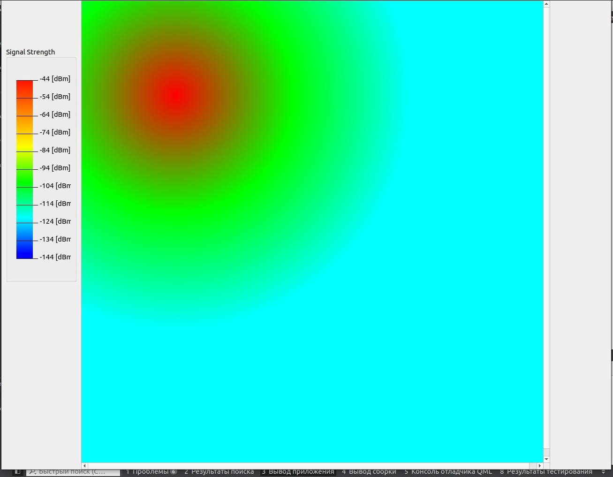

# Signal-Model

## Первая Лабораторная 
## Задание Тепловая Карта
### 1. Создать окно приложения при помощи класса [QMainWindow](https://www.notion.so/QMainWindow-68158b86590749ce9dcd094a91220c93?pvs=21);
### 2. Создать пиксельную карту (**не менее 1000x1000 пикселей**);
### 3. Случайным образом установить Точку доступа (базовую станцию) 5G New Radio.
### 4. Отрисовать тепловую карту (закрасить каждый пиксель определенным цветом) для модел распространения радиосигнала из спецификации 3GPP TR 38.901, пункт 7.4 (выбрать случайную модель из таблицы)
### Вывод Программы

