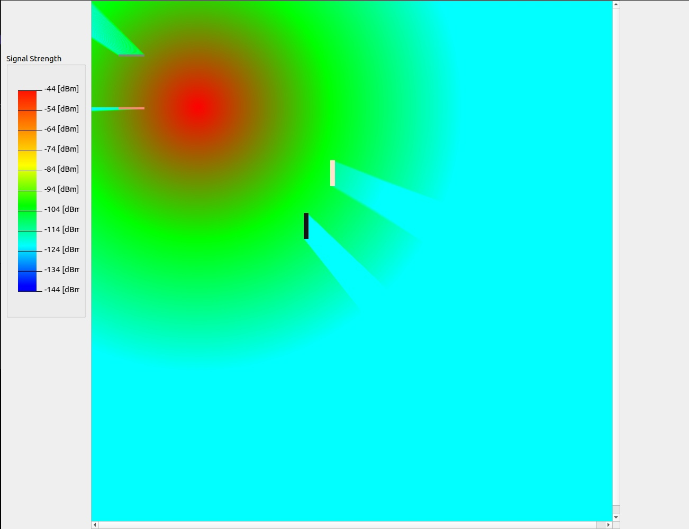

# Signal-Model

## Первая Лабораторная 
## Задание Тепловая Карта
### 1. Создать окно приложения при помощи класса [QMainWindow](https://www.notion.so/QMainWindow-68158b86590749ce9dcd094a91220c93?pvs=21);
### 2. Создать пиксельную карту (**не менее 1000x1000 пикселей**);
### 3. Случайным образом установить Точку доступа (базовую станцию) 5G New Radio.
### 4. Отрисовать тепловую карту (закрасить каждый пиксель определенным цветом) для модел распространения радиосигнала из спецификации 3GPP TR 38.901, пункт 7.4 (выбрать случайную модель из таблицы)
### Вывод Программы

## Вторая лабораторная
## Задание Препятствие 
### 1. Случайным образом установить на PixMap препятствия (круги, прямые, прямоугольники и т.д.) заранее определяя тип материала:
###    1. Стеклопакет
###    2. IRR стекло
###    3. Бетон
###    4. Дерево\гипсокартон
### 2. Используя алгоритм [Брезенхэма](https://ru.wikipedia.org/wiki/%D0%90%D0%BB%D0%B3%D0%BE%D1%80%D0%B8%D1%82%D0%BC_%D0%91%D1%80%D0%B5%D0%B7%D0%B5%D0%BD%D1%85%D1%8D%D0%BC%D0%B0) [2], найти количество препятствий на пути луча от т**очки доступа** до каждого пикселя. Посчитать количество найденных препятствий.
### 3. На основании спецификации 3GPP TR 38.901 (**7.4.3.1 O2I building penetration loss**) посчитать степень затухания радиосигнала при прохождении через препятствие [1]. Вычесть полученное затухание от основного бюджета канала.
### 4. Закрасить соответствующим образом каждый пиксель.
### Вывод Программы 

## Третяя Лабораторная 
## Задание Вопросы архитектуры приложения
### 1. Создать новую ветку вашего **Git-проекта**. Название ветки на свое усмотрение;
### 2. Реализовать собственный класс “**Тепловой карты**”. Класс должен включать методы:
###    1. Вычисления цвета каждого пикселя на основе мощности радиосигнала;
###    2. Раскраска тепловой карты по выбранным цветам;
###   3. Доп. методы. Смысловые, на свое усмотрение;
### 3. Реализовать класс “Propagation Model”, который должен включать в себе все модели по спецификации 3GPP 38.901;
### 4. Реализовать класс “Материалов”, который будет помогать считать формулу для затухания при прохождении через стены.
### 5. Реализовать git push на новую ветку (созданную в пункте 1);
### 6. Выполнить слияние новой ветки в свою основную.
